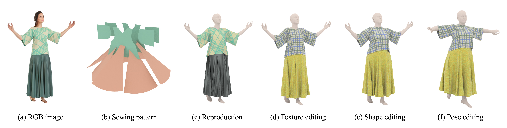

# PatternGenFormer

---------------------------

### Installation and Configuration
* Clone this repository to `path_to_dev` and `cd path_to_dev/PatternGenFormer`, and `cd path_to_dev/Sewformer`, download the pre-trained [checkpoint](https://huggingface.co/irukapathirana/PatternGenFormer) and put it into `assets/ckpts`.

* The environment can be initialized with `conda env create -f environment.yaml`. Then you can activate the environment `conda activate garment`.
* `cd path_to_dev/PatternGenFactory` and add `path_to_dev/PatternGenFactory/packages` to `PYTHONPATH` on your system for correct importing of our custom modules.

### Training (No need to done if using the pretrained module)
* Download provided [dataset](https://huggingface.co/datasets/liulj/sewfactory) and put it into `path_to_patterngenfactory`, update the local paths in `system.json` to make sure the dataset setup correctly. 
* Train the model with
`torchrun --standalone --nnodes=1 --nproc_per_node=1 train.py -c configs/train.yaml`

  The output will be located at the `output` in `system.json`.

### Testing 

1. Inference sewing patterns with the pretrained model: 

* evaluate on patterngenfactory dataset: `torchrun --standalone --nnodes=1 --nproc_per_node=1 train.py -c configs/train.yaml -t`

* inference on real images (e.g. from deepfashion):
    `python inference.py -c configs/test.yaml -d assets/data/deepfashion -t deepfashion -o outputs/deepfashion` 

2. Simulate the predicted results (Windows):
`cd path_to_dev/PatternGenFactory` and run `path_to_maya\bin\mayapy.exe .\data_generator\deepfashion_sim.py` to simulate the predicted sew patterns. (Please prepare the SMPL prediction results with [RSC-Net](https://github.com/xuxy09/RSC-Net) and update the predicted data root specified in `deepfashion_sim.py`.)

    See more details about the PatternGenFactory dataset and the simulation [here](PatternGenFactory/ReadMe.md).
